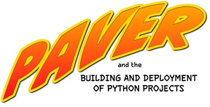

===========================================
Paver: Easy Scripting for Software Projects
===========================================

`Japanese translation available <https://paver.github.io/paver-docs-jp/>`_
thanks to Tetsuya Morimoto. Latest stable documentation is
`on PyPI <https://pypi.python.org/pypi/Paver>`_, latest development docs are
`on GitHub<https://github.com/paver/paver/tree/master/docs>`_

Paver is a Python-based software project scripting tool along the
lines of Make or Rake. It is not designed to handle the dependency
tracking requirements of, for example, a C program. It *is* designed
to help out with all of your other repetitive tasks (run documentation
generators, moving files around, downloading things), all with the
convenience of Python's syntax and massive library of code.

If you're developing applications in Python, you get even more...
Most public Python projects use distutils or setuptools to create source
tarballs for distribution. (Private projects can take advantage of
this, too!) Have you ever wanted to generate the docs before building the
source distribution? With Paver, you can, trivially. Here's a complete
pavement.py::

    from paver.easy import *
    from paver.setuputils import setup
    
    setup(
        name="MyCoolProject",
        packages=['mycool'],
        version="1.0",
        url="https://www.blueskyonmars.com/",
        author="Kevin Dangoor",
        author_email="dangoor@gmail.com"
    )
    
    @task
    @needs(['html', "distutils.command.sdist"])
    def sdist():
        """Generate docs and source distribution."""
        pass
        
With that pavement file, you can just run ``paver sdist``, and your docs
will be rebuilt automatically before creating the source distribution.
It's also easy to move the generated docs into some other directory
(and, of course, you can tell Paver where your docs are stored,
if they're not in the default location.)

Features
--------

* Build files are :ref:`just Python <justpython>`
* :ref:`One file with one syntax <onefile>`, pavement.py, knows how to manage
  your project
* :ref:`File operations <pathmodule>` are unbelievably easy, thanks to the 
  built-in version of Jason Orendorff's path.py.
* Need to do something that takes 5 lines of code? 
  :ref:`It'll only take 5 lines of code. <fivelines>`.
* Completely encompasses :ref:`distutils and setuptools  <setuptools>` so 
  that you can customize behavior as you need to.
* Wraps :ref:`Sphinx <doctools>` for generating documentation, and adds utilities
  that make it easier to incorporate fully tested sample code.
* Wraps :ref:`Subversion <svn>` for working with code that is checked out.
* Wraps :ref:`virtualenv <virtualenv>` to allow you to trivially create a
  bootstrap script that gets a virtual environment up and running. This is
  a great way to install packages into a contained environment.
* Can use all of these other libraries, but :ref:`requires none of them <nodeps>`
* Easily transition from setup.py without making your users learn about or
  even install Paver! (See the :ref:`Getting Started Guide <gettingstarted>` 
  for an example).

See how it works! Check out the :ref:`Getting Started Guide <gettingstarted>`.

Paver was created by `Kevin Dangoor <https://blueskyonmars.com>`_ of `SitePen <https://sitepen.com>`_.

Status
------

Paver has been in use in production settings since mid-2008, and significant 
attention is paid to backwards compatibility since the release of 1.0.

See the :ref:`changelog <changelog>` for more information about recent improvements.

Installation
------------

The easiest way to get Paver is if you have pip_ or distutils_ installed.

``pip install Paver``

or

``easy_install Paver``

Without setuptools, it's still pretty easy. Download the Paver .tgz file from 
`Paver's Cheeseshop page`_, untar it and run:

``python setup.py install``

.. _Paver's Cheeseshop page: https://pypi.python.org/pypi/Paver/
.. _pip: https://www.pip-installer.org
.. _distribute: https://pypi.python.org/pypi/distribute

Help and Development
--------------------

You can get help from the `mailing list`_.

If you'd like to help out with Paver, you can check the code out from github:

``git clone https://github.com/paver/paver.git``

Ideally, create a fork, fix an issue from `Paver's list of issues`_ (or create an issue
Yourself) and send a pull request.

Your help is appreciated!

Running test suite
===================

Paver contains both unit and integration test suite. Unittests are run by either
``paver test`` or ``paver unit``. Integration tests can be run by ``paver integrate``.

Using older, system-wide installed paver to run tests on development version can lead
to bad interactions (see `issue 33`_). Please, run paver test suite using development
version itself, by:

* Creating virtual environment with --no-site-packages

and

* Installing development version with python setup.py develop

or

* Using embedded minilib, thus invoking commands with setup.py instead of paver

.. _mailing list: https://groups.google.com/group/paver
.. _Paver's list of issues: https://github.com/paver/paver/issues
.. _issue 33: https://github.com/paver/paver/issues/33

License
-------

Paver is licensed under a BSD license. See the LICENSE.txt file in the 
distribution.

Contents
--------

.. toctree::
   :maxdepth: 2
   
   foreword
   features
   getting_started
   pavement
   paverstdlib
   cmdline
   tips
   articles
   paverfullapi
   changelog
   credits

Indices and tables
------------------

* :ref:`genindex`
* :ref:`modindex`
* :ref:`search`

